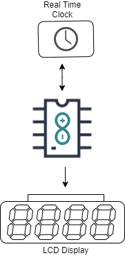
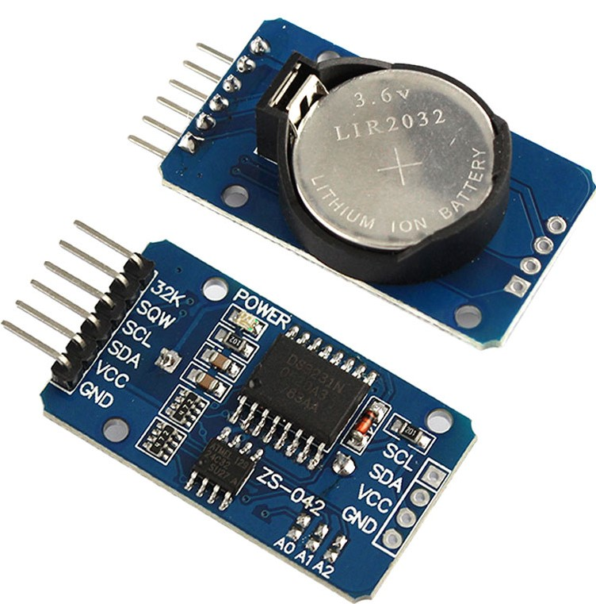

# Digital Clock

In this workhop we will learn how to how to make a digital clock using arduino and RTC module. 

### Objective 

Build a digitalClock using arduino and RTC module, that will keep the time even arduino is turne off . 

### Prototype Building

Here we are using an Arduino as controller and DS323 Real Time Clock module to Count and keep the time and 16x2 LCD Display to Display the Time and Date. 

### Things we need 

1. Arduino Uno
2. Real Time Clock Module
3. 16x2 LCD Module
4. 10k ohm potentiometer
5. 220 ohm resistor
6. Jumper Wires
7. Breadboard

#### DS3231 Real Time Clock

The **DS3231** is a low-cost, highly accurate Real Time Clock which can maintain hours, minutes and seconds, as well as, day, month and year information. Also, it has automatic compensation for leap-years and for months with fewer than 31 days.

The module can work on either 3.3 or 5 V which makes it suitable for many development platforms or microcontrollers. The battery input is 3V and a typical CR2032 3V battery can power the module and maintain the information for more than a year.

The module uses the I2C Communication Protocol which makes the connection to the Arduino Board very easy.

